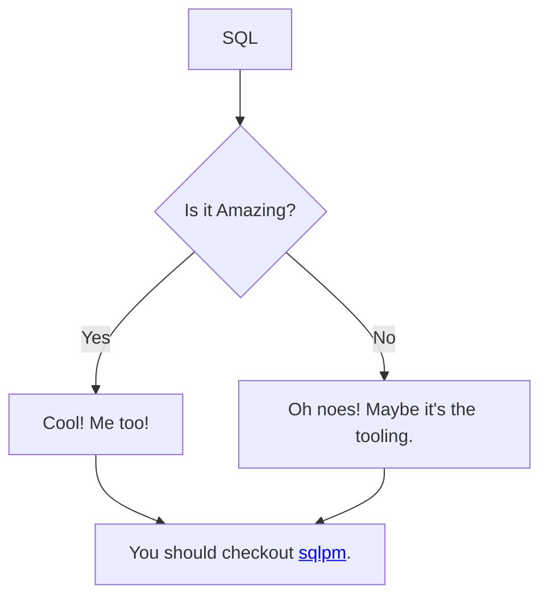

# Eric Hosick

```mermaid
graph TD;
  A[SQL]-->B{Is it Amazing?};
  B -- Yes -->C[Cool! Me too!];
  B -- No --> D[Oh noes! Maybe it's the tooling.];
  C --> E
  D --> E
  E[You should checkout <a href='https://github.com/erichosick/sqlpm/tree/main/packages/sqlpm'>sqlpm</a>.]
```
