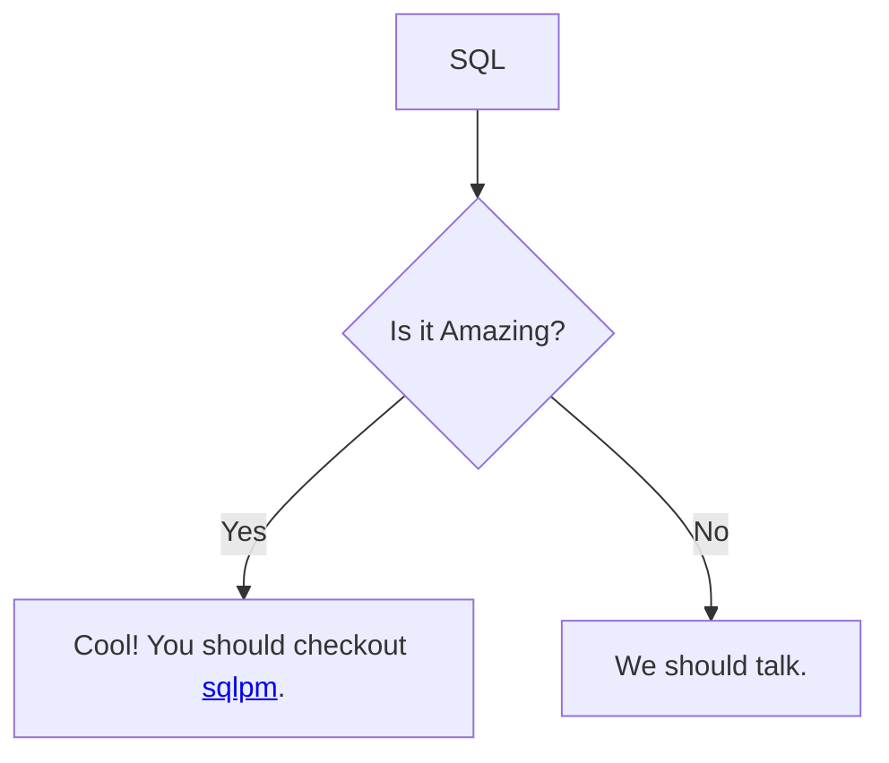

# Eric Hosick

```mermaid
  graph TD;
    A[SQL]-->B{Is it Amazing?};
    B -- Yes -->C[Cool! You should checkout <a href='https://github.com/erichosick/sqlpm/tree/main/packages/sqlpm'>sqlpm</a>.];
    B -- No --> D[We should talk.];
```
