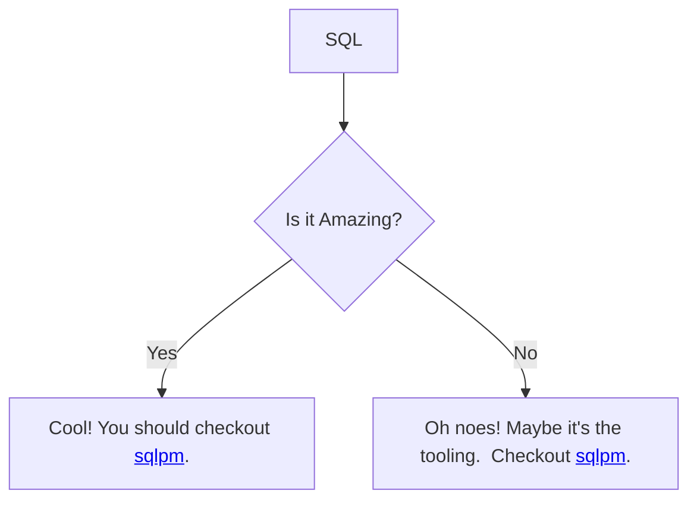

# Eric Hosick

```mermaid
graph TD;
  A[SQL]-->B{Is it Amazing?};
  B -- Yes -->C[Cool! You should checkout <a href='https://github.com/erichosick/sqlpm/tree/main/packages/sqlpm'>sqlpm</a>.];
  B -- No --> D[Oh noes! Maybe it's the tooling. <cr> Checkout <a href='https://github.com/erichosick/sqlpm/tree/main/packages/sqlpm'>sqlpm</a>.];
```
